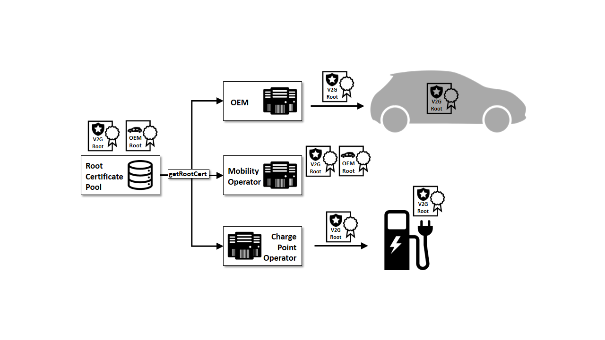
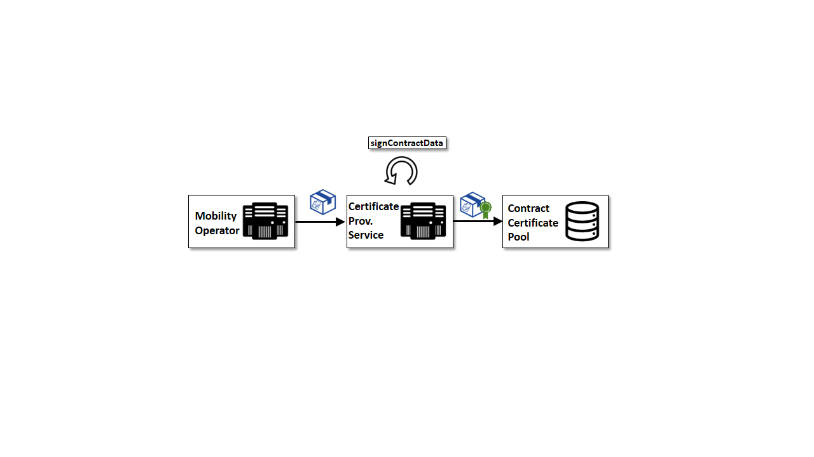
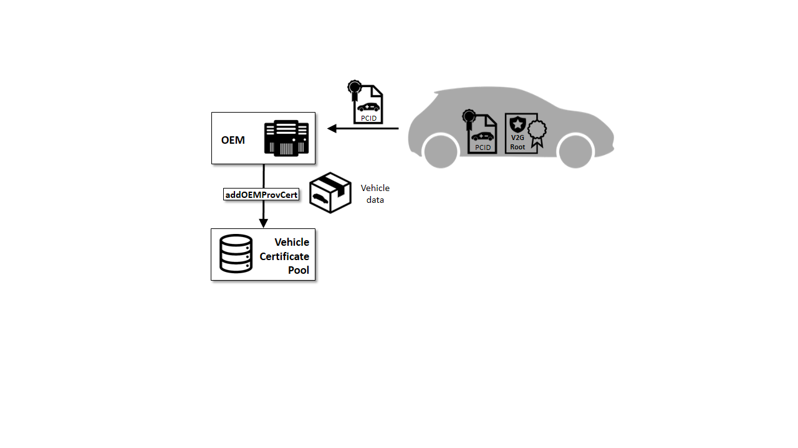

# Business Processes

This section summarizes all processes of Plug and Charge as described as _Certificate Provisioning_ in ISO 15118 Section 7.9.2.5 and explained in more detail in Appendix E.3.

The VDE Application Rule focusses on these processes and details each process flow for further understanding. The following figure shows the overall process with components and flows, which are based on the VDE Application Rule.

During contract provisioning, several sub-processes are also required, which can be divided into four main parts:

 1. **Vehicle production and preparation of contract based billing**
   - The OEM generates a Provisioning Certificate for each electric vehicle during production.
   - The OEM installs a trust store containing all relevant Root Certificates from the Root Certificate Pool.
 2. **Contract conclusion and vehicle assignment**
   - The MO concludes a charging contract for a specific customer's electric vehicle, using the vehicles Provisioning Certificate from the Provisioning Certificate Pool.
   - Providing contract data to the Certificate Provisioning Service or
   - Providing contract information to V2G Mobility Operator CA
  3. **(Periodic) provisioning of contract data**
   - Signing contract data and storing in the CCP
   - Generating contract data in V2G Mobility Operator CA and storing in the CCP
 4. **Installation of contract data**
   - Providing signed contract data to CPO-backend on request
   - Delivery of signed contract data to OEM-backend

## Business Processes relevant for all participants

#### Providing Root Certificates for Public Charging and Contract-Based Billing
The mutual trust between participants is a precondition for ISO 15118 and thus Plug&Charge to function. For this purpose, a Root Certificate Pool is set up for the storage of all Root certificates. Each participant gets access to receive the Root certificates of other participants to validate the trust chain of each certificate.

## Business Processes relevant for the CPO

### Providing Signed Contract Data to CPO-Backend on Request

Alternative to the OEM backend, is the installation of signed contract data via the charging station. The OEMs, which do not use an OEM backend, can use this process for the delivery of contract data.
After a successful handshake between EV and charging device, the EV sends a certificateInstallationRequest to the charging device, which will be forwarded via the CPO backend to the CCP.
The CCP finds the contracts of this EV, verifies the validity of each certificate and delivers it back to the CPO backend.

## Business Processes relevant for the MO

### Contract Conclusion and Vehicle Assignment

This process describes, the conclusion of contract between customer and MO and delivery of OEM provisioning certificate of vehicle to the MO.
The MO must receive the contract information from a customer including the PCID of the vehicle. The Provisioning Certificate with the regarding PCID must be sent by the MO to the PCP beforehand. The PCP delivers the OEM provisioning certificate, including the corresponding Sub CA chain (See Figure 5).

After verifying the authenticity of the trust chain with the OEM root certificate (which has been received from the Root Certificate Pool), the MO can generate a unique e-mobility account identifier for this contract. To create a contract for the customer, MOs have two possibilities:

 - Create and send the contract data to the CPS using the MOs own CA, which is described in the “Providing Contract Data to Certificate Provisioning Service” process
 - Or use V2G-PKI MO CA services to create, sign and store the contract data

### Providing Contract Data to Certificate Provisioning Service

If the MO uses its own CA, it must create a contract data with the following parts:
 - contractSignatureCertChain,
 - dhPublicKey,
 - contractSignatureEncryptedPrivateKey,
 - EMAID

The created contract data must be signed by the CPS.

Moving forward, MOs have two possibilities:
 - signing and storing of signed contract data in the CCP
 - signing the contract data and receive the signed contract data without storing them in the CCP

### Provisioning of Contract Data

Signing Contract Data and Storing in CCP:
The CPS signs the delivered contract data with the V2G Root CA derived Provisioning Certificate private key. Then the CPS either stores it in the CCP for provisioning for the CPO and OEM backends or sends it back to the MO.
In this latter method, the MO would have to use addSignedContractData to store contract data into a CCP. 

### Generating Contract Data with CPS Mobility Operator Service and Storing in CCP

If the MO does not create and sign the contract data (using createSignedContractData method), the V2G MO CA Operator and CPS Operator can generate a contract data with the received contract information from the MO. The CPS Operator would then send the contract data to the CPS for signing and then store the signed contract data in the CCP.

## Business Processes relevant for the OEM

### Production of Vehicles and Storing Provisioning Certificate

With the production of the vehicle, the OEM must create a provisioning certificate for each vehicle with a unique provisioning certificate identifier – PCID. The OEM sends this unique OEM provisioning certificate corresponding subordinate CA (Sub CA) certificates securely to the Provisioning Certificate Pool.
The customers shall also receive the PCID of their vehicles to give it to the MOs, during the conclusion of a charging contract.
The required V2G root certificates shall also be installed and stored in the vehicle for the trusted communication with charging devices and to verify contract data.

## Pool management
 * Cleanup of RCP, PCP and CCP by:
   * Revoked certificate shall be removed on regular basis from pools.
   * Expired certificates shall be removed on regular basis from pools.
 