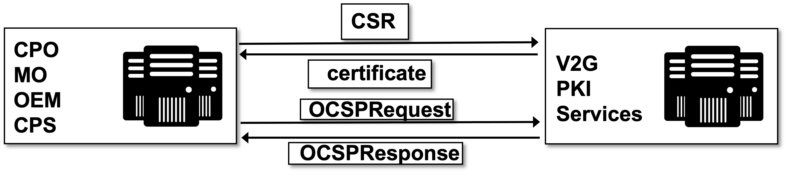
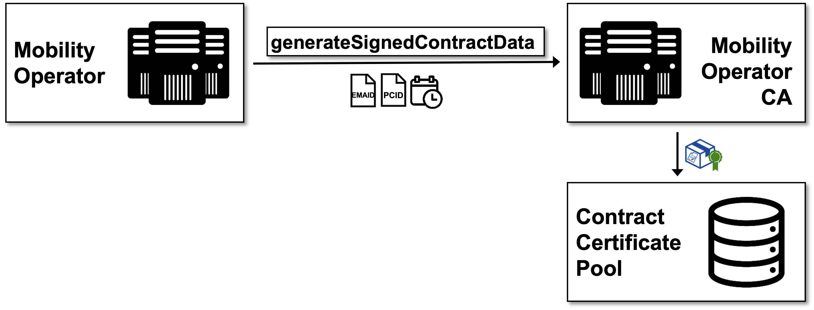

# V2G PKI Services

A Plug&Charge PKI Service includes all necessary components of a PKI infrastructure with the following components:

 * Certificate Manager
 * HSMs
 * OCSP responder (if applicable)
 * CRL distribution points (if applicable)
 * MO CA

These services provide interfaces to CPOs, MOs, CPSs and OEMs for issuing/signing certificates and also request certificate statuses.




## MO Plug&Charge Contract Service

MO Plug&Charge Contract Service can be part of Plug&Charge CPS Services and provides interfaces for MOs to issue and sign their contract certificates/bundles without the need for any own MO-PKI. This service creates certificates and performs all needed cryptographic operations to created ISO15118 compliant signed contract data.




## EST interface

EST interface receives CSRs from CPOs, CPSs, MOs or OEMs, signs them and delivers an ISO 15118 leaf certificate. The Hubject Certificate Manager creates the leaf certificates from the reagarding Sub 2 CA of the respective part of the V2G Root CA.

This interface can create certificates for CPOs (EVSE leaf certificate), MOs (contract leaf certificate), CPSs (certificate provisioinig certificates) and OEMs (OEM provisioning certificates)

A valid authentication to the EST services is necessary to use this interface.

EST interface is a standard implementation, which is described in the [RFC7030](https://tools.ietf.org/html/rfc7030).

**Operations and their corresponding URIs:**

Operation| Operation path  | Details in RFC
---------|----------|---------
 Distribution of CA Certificates | /cacerts | [RFC Section 4.1](https://tools.ietf.org/html/rfc7030#section-4.1)
 Enrollment of Clients | /simpleenroll  | [RFC Section 4.2](https://tools.ietf.org/html/rfc7030#section-4.2)


The EST interface of the Hubject Plug&Charge PKI Services is fully compliant with RFC7030.

> For the implementation of an EST client, you can use the open source library [libest from CISCO](https://github.com/cisco/libest/tree/master/example/client-simple) or the EST package from [BouncyCastle](https://www.bouncycastle.org/docs/pkixdocs1.5on/org/bouncycastle/est/package-summary.html)

### EVSE leaf certificates (SECC certificate)
By means of the charge point certificate, the charge point provides its authentication to the vehicle. During a TLS handshake, the charge point establishes a TLS connection to the vehicle. That provides its authentication to the vehicle by sending its charge point certificate and the CPO sub-CA certificates. This certificate chain has been derived from a V2G root CA.
The associated private key of a charge point certificate is stored in the charge point.

The EVSE leaf certificate contains its EVSE ID as common name, the structure of which is defined in the [identifier description chapter](../05_handling-of-ids.md).

### Contract leaf certificates
The contract certificate is used in the case of the Plug & Charge authentication and authorisation modes at a charge point, in contrast to external identification means (EIM). It shall be assigned to a valid contractual relationship between the vehicle user (or owner) and mobility operator and shall be saved in the vehicle together with the private key that is associated with this contract certificate.

The electric vehicle accesses this digital certificate in order to prove the existence of a valid charging contract to the charge point. Contract certificates are derived – via intermediate sub-CAs – from MO root CAs or V2G root CAs.

The MO contract certificate contains a EMAID as common name, the structure of which is defined in the [identifier description chapter](../05_handling-of-ids.md)

### OEM provisioning certificates
An OEM provisioning certificate is issued individually for and saved in each electric vehicle. It shall be possible to renew the provisioning certificate in the vehicle if it is revoked. The process of renewing the certificate is specific to each OEM and can be carried out by a workshop or by means of an online process using the OEM backend and telematics link of the EV. It is used to verify the identity of the electric when provisioning a contract certificate. It is derived from the OEM root CA or a V2G root CA via a chain of OEM sub-CAs.

The OEM provisioning certificate contains a PCID as common name, the structure of which is defined in the [identifier description chapter](../05_handling-of-ids.md).

### CPS Provisioning signing certificates
An CPS Provisioning signing certificate is issued regularly by a CPS Operator by a V2G PKI Authority. It shall be possible to renew the provisioning signing certificate. It is used to sign contract data and install them securly into an EV. It is derived from the V2G root CA via a chain of CPS Sub-CAs.

### Certificate Signing Request
CSR or Certificate Signing request, is a block of encoded text that is given to a Certificate Authority when applying for an digital Certificate. It is usually generated on the server/end-device, where the certificate will be installed, and contains information that will be included in the certificate, such as the organization name, common name (domain name), locality, and country. It also contains the public key that will be included in the certificate. A private key is usually created at the same time that you create the CSR, making a key pair. A CSR is generally encoded using ASN.1 according to the PKCS #10 specification.

A certificate authority will use a CSR to create your digital certificate, but it does not need your private key. You need to keep your private key secret. The certificate created with a particular CSR will only work with the private key that was generated with it. In the case of losing the private key, the certificate will no longer work.

#### Required CSR Datafields

Name|Explanantion|Example
----|--------|-----
Common Name|The unique [ISO15118 description](../05_handling-of-ids.md) for the certificate. This must match exactly to the ISO15118 and VDE Application Guide standard or you will receive a name mismatch error in the PnC Ecosystem|PCID: e.g. WP012345678901234
Organization|	The legal name of your organization. This should not be abbreviated and should include suffixes such as Inc, Corp, or LLC.|Hubject GmbH

#### CSR Example
```
-----BEGIN CERTIFICATE REQUEST-----
MIIByjCCATMCAQAwgYkxCzAJBgNVBAYTAlVTMRMwEQYDVQQIEwpDYWxpZm9ybmlh
MRYwFAYDVQQHEw1Nb3VudGFpbiBWaWV3MRMwEQYDVQQKEwpHb29nbGUgSW5jMR8w
HQYDVQQLExZJbmZvcm1hdGlvbiBUZWNobm9sb2d5MRcwFQYDVQQDEw53d3cuZ29v
Z2xlLmNvbTCBnzANBgkqhkiG9w0BAQEFAAOBjQAwgYkCgYEApZtYJCHJ4VpVXHfV
IlstQTlO4qC03hjX+ZkPyvdYd1Q4+qbAeTwXmCUKYHThVRd5aXSqlPzyIBwieMZr
WFlRQddZ1IzXAlVRDWwAo60KecqeAXnnUK+5fXoTI/UgWshre8tJ+x/TMHaQKR/J
cIWPhqaQhsJuzZbvAdGA80BLxdMCAwEAAaAAMA0GCSqGSIb3DQEBBQUAA4GBAIhl
4PvFq+e7ipARgI5ZM+GZx6mpCz44DTo0JkwfRDf+BtrsaC0q68eTf2XhYOsq4fkH
Q0uA0aVog3f5iJxCa3Hp5gxbJQ6zV6kJ0TEsuaaOhEko9sdpCoPOnRBm2i/XRD2D
6iNh8f8z0ShGsFqjDgFHyF3o+lUyj+UC6H1QW7bn
-----END CERTIFICATE REQUEST-----
```

## OCSP Service

OCSP responders of the Plug&Charge V2G-PKI Service publishes the status information of the certificates, which are created by the Certificate Authority.

This endpoint does not require authentication.

OCSP interface is a standard implementation, which is described in [RFC6960](https://tools.ietf.org/html/rfc6960).


