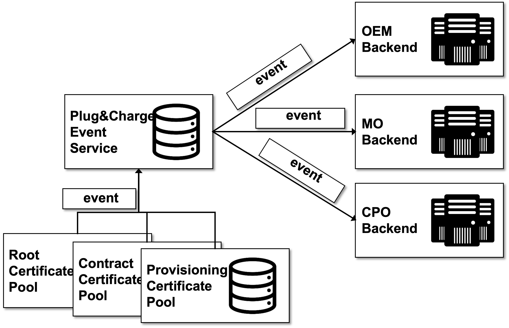

# Webhook Notification Service

PnC Ecosystem Operator uses webhooks so when some event happens in our ecosystem your backend system is notified, being able to automatically trigger reactions. 

Webhooks are particularly useful for asynchronous events like when a `contract created` or `root certificate expired`.

The following figure provides a high level overview on the interface concept of the webhook service. The service is subscribed to all relevant events within the ecosystem. The partners can register at the webhook service to observe assets in the ecosystem. Relevant events from the other ecosystem components are collected via an event service and forwarded to the partners system.



## What are webhooks 

A webhook enables our ecosystem to push real-time notifications to your backend systems. Webhooks Service uses HTTPS to send these notifications to your backend endpoint as a JSON payload. You can then use these notifications to execute actions in your backend systems.

### Available Events

The available event notifications are listed in the interface API itself:
[Event Actions](../../reference/webhooks.v1.json)

## API

The webhooks service requires the partner to provide a simple payload-service with public endpoint to receive events as `POST` request.
The required API documentation can be found at [webhooks.v1.json](../../reference/webhooks.v1.json).


## Error handling

The webhook service has a retry mechanism in place - for http 5xx Server Errors Operator will retry 3 times in 1 hour interval, after 3 times Operator will unload the event as a failed event.

## Payload structure
```
Request: POST /payload-path HTTP/1.1
Host: your-payload-url.com
Headers:

Content-Type: application/json
X-Hubject-Signature: sha256=7808b566f4057216e64c6298bfd5a184d4d715ffec6599311e5266f48865XXXX

Body:
{
    "eventId": "caf56bee-f90d-4e81-a862-7e0d0f21d306",
    "eventType": "oem.contract.created",
    "payload": {
        "emaid": "TESTEMAID",
        "pcid": "TESTPCID"
    }
}
```

## Validating payloads

Operator can optionally sign the webhook events it sends to your endpoints by including a signature in each event’s `X-Operator-Signature` header. This allows you to verify that the events were sent by the Operator, not by a third party.

In order to validate signature you will need `secret` of your endpoint, you can find it when you create new endpoint for the webhook or retrieving endpoint from the `webhooks` backend.

Operator generates signatures using a hash-based message authentication code [HMAC](https://en.wikipedia.org/wiki/HMAC) with [SHA-256](https://en.wikipedia.org/wiki/SHA-2). To prevent [downgrade attacks](https://en.wikipedia.org/wiki/Downgrade_attack)

You can create a custom solution by following these steps.

Step 1: Prepare the `message` string 
- Get the actual JSON payload (i.e., the request body)

Step 2: Determine the expected signature 
- Compute an HMAC with the SHA256 hash function. Use the endpoint’s signing secret as the key, and use the Request body string as the message.

Step 3: Compare the signature
- Compare the signature in the header to the expected signature.

For example, if you have a basic server that listens for webhooks, it might be configured similar to this:
```go
import (
	"fmt"
	"io"
	"log"
	"net/http"
)

func Payload(w http.ResponseWriter, r *http.Request) {
	b, err := io.ReadAll(r.Body)
	if err != nil {
		log.Fatalln(err)
	}

	fmt.Println("I got some JSON: " + string(b))
}
```

Recommended way is to calculate a hash using your webhooks `secret`, and ensure that the result matches the Signature from Operator. Operator uses an HMAC hex digest to compute the hash, so you could reconfigure your server to look a little like this:

```go
import (
	"crypto/hmac"
	"crypto/sha256"
	"encoding/hex"
	"encoding/json"
	"fmt"
	"io"
	"log"
	"net/http"
)

func Payload(w http.ResponseWriter, r *http.Request) {
	b, err := io.ReadAll(r.Body)
	if err != nil {
		log.Fatalln(err)
	}

	operatorSig := r.Header.Get("X-Operator-Signature")
	sig, err := hex.DecodeString(operatorSig)

	if err != nil {
		w.WriteHeader(401)
		return
	}

	secret := os.Getenv("WEBHOOK_SECRET")
	expectedSignature := ComputeSignature(b, secret)

	if !hmac.Equal(expectedSignature, sig) {
		w.WriteHeader(401)
		fmt.Println("I got some invalid signature")
		return
	}

	fmt.Println("I got some JSON with valid signature: " + string(b))
}

func ComputeSignature(payload []byte, secret string) []byte {
	mac := hmac.New(sha256.New, []byte(secret))
	mac.Write(payload)
	return mac.Sum(nil)
}
```
### Java Example
```java

    @POST
    @Produces(MediaType.TEXT_PLAIN)
    @Consumes(MediaType.APPLICATION_JSON)
    public Response payload(@Context HttpServletRequest request) throws IOException {
        String body = request.getReader().lines().collect(Collectors.joining(System.lineSeparator()));
        String header = request.getHeader("X-Operator-Signature");
        try {
            verifyHeader(body, header, webhookSecret);
            logger.infof("valid signature in header %s", header);
            logger.infof("received body: %s", body);
        } catch (SignatureVerificationException e) {
            logger.errorf("Invalid signature %s", e.getMessage());
            return Response.status(HttpResponseStatus.FORBIDDEN.code()).build();
        }
        return Response.ok().build();
    }

    public static void verifyHeader(String payload, String sigHeader, String secret)
            throws SignatureVerificationException {

        if (sigHeader == null || "".equals(sigHeader)) {
            throw new SignatureVerificationException("Invalid X-Operator-Signature header");
        }

        // X-Operator-Signature will come in format of sha256=ABC...XYZ
        // therefore we should split it into 2 parts and get signature value
        String operatorSig = sigHeader.split("=")[1];

        // Compute expected signature
        String expectedSignature;
        try {
            expectedSignature = computeHmacSha256(payload, secret);
        } catch (Exception e) {
            throw new SignatureVerificationException("Unable to compute signature for payload");
        }
        // Check if expected signature is equal X-Operator-Signature signature
        if (!secureCompare(expectedSignature, operatorSig)) {
            throw new SignatureVerificationException("No signatures found matching the expected signature for payload");
        }
    }

    public static boolean secureCompare(String a, String b) {
        byte[] digesta = a.getBytes(StandardCharsets.UTF_8);
        byte[] digestb = b.getBytes(StandardCharsets.UTF_8);

        return MessageDigest.isEqual(digesta, digestb);
    }

    public static String computeHmacSha256(String message, String key)
            throws NoSuchAlgorithmException, InvalidKeyException {
        Mac hmac = Mac.getInstance("HmacSHA256");
        hmac.init(new SecretKeySpec(key.getBytes(StandardCharsets.UTF_8), "HmacSHA256"));
        byte[] hash = hmac.doFinal(message.getBytes(StandardCharsets.UTF_8));
        StringBuilder result = new StringBuilder();
        for (byte b : hash) {
            result.append(Integer.toString((b & 0xff) + 0x100, 16).substring(1));
        }
        return result.toString();
    }

    private static class SignatureVerificationException extends Exception {
        public SignatureVerificationException(String message) {
            super(message);
        }
    }
```


NOTE:
 - Using a plain == operator is not advised. A method like secure_compare performs a "constant time" string comparison, which helps mitigate certain timing attacks against regular equality operators.
