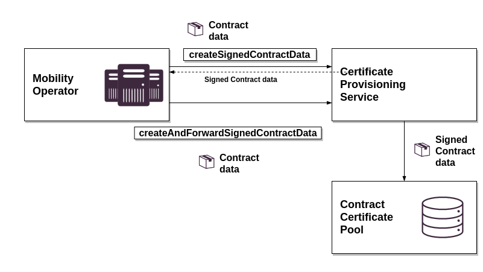

# Certificate Provisioning Service

The CPS provides interfaces for generating and signing contract data of MOs. MOs can provide a contract data to sign in CPS or send contract information to generate contract data in the V2G Mobility Operator CA. The signed contract data are either returned to the MO or stored in the CCP.

## API

The Certificate Provisioning Service offers a REST API to send Contract Data in order to let it sign. The API consumer can choose from two methods: One forwarding the Signed Contract Data directly into the Contract Certificate Pool an another one returning it to the caller..

All CCP API documenatation can be found at `cps.v1.yaml`.

