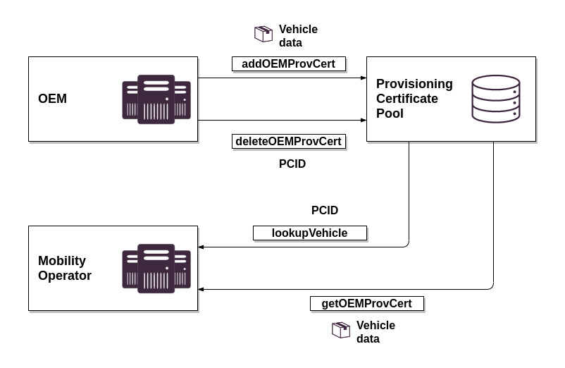

# Provisioning Certificate Pool

The Provisioning Certificate Pool provides interfaces to exchange Provisioning Certificates between OEMs and MOs,under the following workflow: MO sends the PCID of a Provisioning Certificate issued by the OEM, and receives its Provisioning Certificate with the corresponding certificate chain.

OEMs publish their Provisioning Certificates on the pool after their generation, e.g. after the car get manufactured. MOs request foreign Provisioning Certificates from the pool by PCID.

The PCP communicates with the following actors and services:
 * OEM
 * Mobility Operator
 * Contract Certificate Pool
 * OCSP Responders of the Provisioning Certificates
 * Root Certificate Pool

## Data Access

It is ensured that the safety precautions of ISO 15118 are complied with, and only trustworthy MOs have granted access. In addition, no confidential OEM data, such as the number of available electric vehicles, can be displayed when querying the available OEM Provisioning Certificates.

Every authorized MO access is granted to all available Provisioning Certificates in the pool.

The Provisioning Certificates of each OEM are separated by access rules. The defined access rules prevent access to other OEM containers. Each OEM can only manage (create/update/delete) Provisioning Certificates of their company. To achieve this, the client credentials of each OEM get white-listed for a list of World manufacturer identifier (WMI) codes (see ISO 3780).

## API

The Provisioning Certificate Pool offers a REST API to request registered Provisioning Certificates.

All documentation can be found in the PCP API Schema at [pcp.v1.json](../../reference/pcp.v1.json).

## Processes

The Provisioning Certificate Pool (PCP) is involved in multiple processes across the ecosystem. The Direct Processes are described bellow:

### 1. Publish a Provisioning Certificate

With the production of a vehicle, the OEM must create a Provisioning Certificate for the vehicle. Each Provisioning Certificate must have an unique Provisioning Certificate Identifier (PCID). The OEM then publishes this Provisioning Certificate as well as its certification chain by sending it to the Provisioning Certificate Pool.

The PCID is the identifier for a vehicle and must match the ISO pattern [PCID Format](#handling-of-ids). The Provisioning Certificate Pool authorizes the OEM client based on this code. [see Data Access](#data-access)

With the publication of a Provisioning Certificate to the pool, no information is given to the MO. Trusted MOs can only retrieve individual Provisioning Certificates if they request them through the PCID.

Therefore the OEM's costumers shall also receive the PCID of their vehicles to give it to the MOs during the conclusion of a charging contract.

The required V2G root certificates shall be stored in the vehicle for the trusted communication with charging devices.

Before the storage of the Provisioning Certificate, the Provisioning Certificate Pool proceeds the following control steps:

 1. Verifies the PCIDs world manufacturer identifier (WMI) against the OEM accounts authorized WMI list.
 2. Verifies the validity date (validUntil) of each certificate from leaf to root to be in the future. (Validity shell model)
 3. Verifies the certificate status of each delivered certificate (leaf and chain) from it's OCSP responder or CRL.
 4. Verifies the trust chain to the OEM root certificate

The PCP responds with an corresponding error code for the first occurring error and stops the processing.

### 2. Update a Provisioning Certificate

In case an OEM needs to renew a Provisioning Certificate, they may do so by sending an updated Certificate to the pool.

The update process overwrites the existing Provisioning Certificate with the same PCID.

<!-- theme: info -->

> An update of a Provisioning Certificate in the pool triggers an instant push notification to all MOs subscribed to the corresponding WMI if the key pair has changed. See [Webhooks Service](#webhook-service)

### 3. Delete a Provisioning Certificate

In case the Provisioning Certificate under one PCID shall be removed from the ecosystem, the OEM that owns it may delete it from the pool.

<!-- theme: info -->

> This operations triggers the Contract Certificate Pool to delete all existing Contract Certificates linked to this Provisioning Certificate. See [Webhooks Service](#webhook-service)

### 4. Request a Provisioning Certificate

Before creating the Contract Data package, the MO has to request the current Provisioning Certificate by the Provisioning Certificate ID from the pool.

### 5. Lookup a Vehicle

This method can be used by the MO to determine for a given PCID if a Provisioning Certificate is available in the PCP.

## Data Cleansing

The stored OEM Provisioning Certificates are checked regularly with automated processes, expired and revoked certificates will be deleted. The deletion of a provisioning certificate triggers a deletion of all connected Contract Certificates from the [Contract Certificate Pool](#contract-certificate-pool)