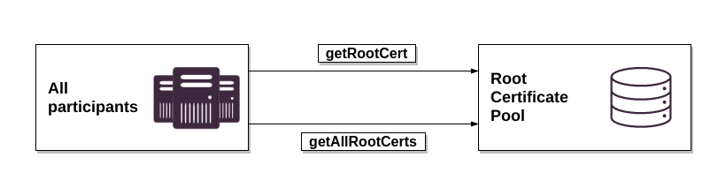

# Root Certificate Pool

The Root Certificate Pool is used for communication between the Root Certificate Pool and the various Certificate Authorities of ISO 15118 participants (V2G, OEM, MO, CPS).
The Root Certificate Pool provides root certificates for ISO 15118 participants. The stored root certificates are checked regularly with automated processes and expired, or revoked certificates deleted. The storage of root certificates is executed manually by RCP Authority administrators.

Other systems of a PnC Ecosystem use this pool as the mutual trust store.

## API

The root certificate pool offers a REST API to request registered root certificates.

The documenatation can be found at [rcp.v1.json](../../reference/rcp.v1.json).

## Processes

The root certificate pool is involved in multiple processes across the ecosystem. The Direct Processes are described bellow:

### 1. Deliver Root Certificates

The delivery of root certificates of the OEM, V2G, MO, and possibly PE-CAs to the Root Certificate Pool is an organizational process, which can be proceeded by different methods, like signed email, SFTP, OFTP2 or similar methodologies. After approval the new root certificates are added to the root certificate pool by the RCP Operator. Therefore the PUT and DELETE interfaces of the pool are restricted for authorized administrative use only.

### 2. Request Root Certificates

All participants of the PKI may request root certificates published in the RCP. The connected systems may request the list of certificates on regular basis.

### 3. Data Cleansing

The Root Certificate Pool watches all contained root certificates on regular basis. 

## Additional notes

If the Root CA revokes a root certificate, the Plug&Charge Ecosystem operator should not delete all its certificates, and their contract data. This can cause deletion of all OEM provisioning certificates and contracts of an OEM. For this case, an organizational process _must_ be defined between the Operator and the respective customers.

Until the delivery of a new OEM root certificate, it will not be possible to send any new OEM provisioning certificate. Because the validation of the trust chain of OEM provisioning certificate cannot be proceeded. For more information about the validation process in `addOEMProvCert` interface, please see chapter interface description.
